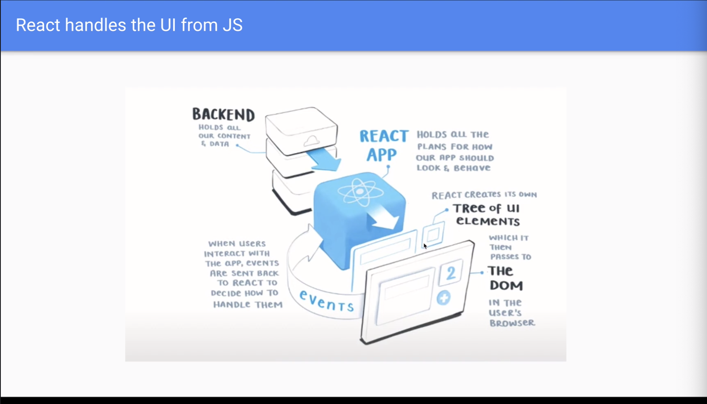
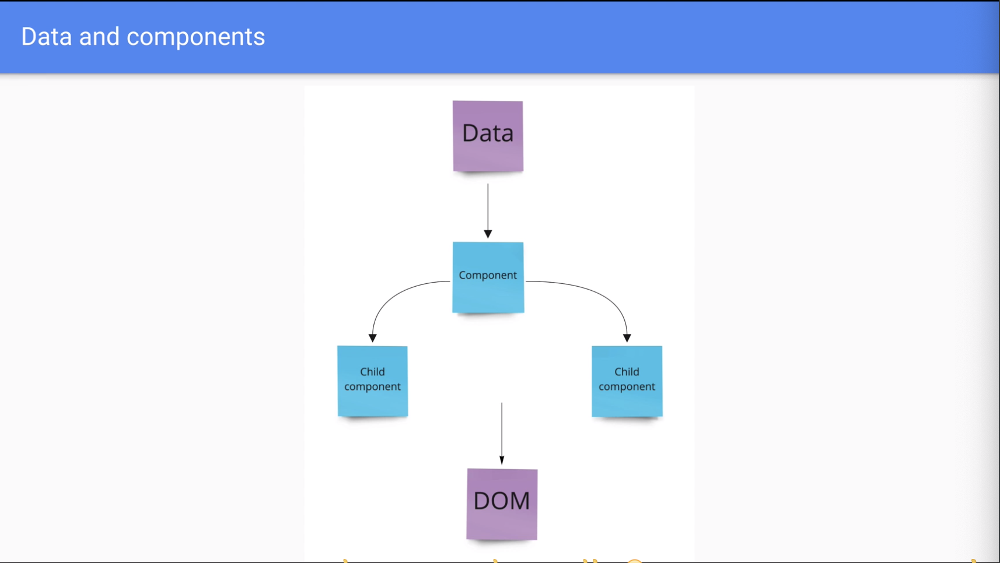

# REACT DOCUMENT

#### This is a document for REACT fundamentals - save it for future reference

---

## What is REACT? 

– REACT is a JavaScript library for building user interfaces

---

## How REACT works?

** – React replaces all DOM/ jQuery elements: replace add event listeners and query selectors**

– React renders your components to the page

– If your data changes, React **automatically** re-renders your components

– **It also updates all the children components**

– The chart belows shows where REACT position is: 

- React is JS UI: instead of writing DOM elements or method, REACT is put in place to do the same job, which create elements and transfer them to DOM, and get event listeners back and apply JS logic to our project

– REACT handles the UI from JS

---

## Relationship between REACT and components

– REACT is made of Components and it's all about components

- level 1: Data 
- level 2: Main Components
- level 3: child Components of main components

- React passes Data down the tree to its' children. If you update main Data, **data will be automatically passes and updates through the tree and changes its children**

---

## Why REACT?

– It's the second popular framework/ library just behind Jquery
– Component composition. You can put components inside a components, reusable components
– Declarative UI. 
– It's mainly **Just JavaScript**. Still uses JavaScript logic 
– It is the right abstraction.It takes care of complex code behind the scene and makes it
– Popularity means there are a ton of tools and resources for REACT

---

